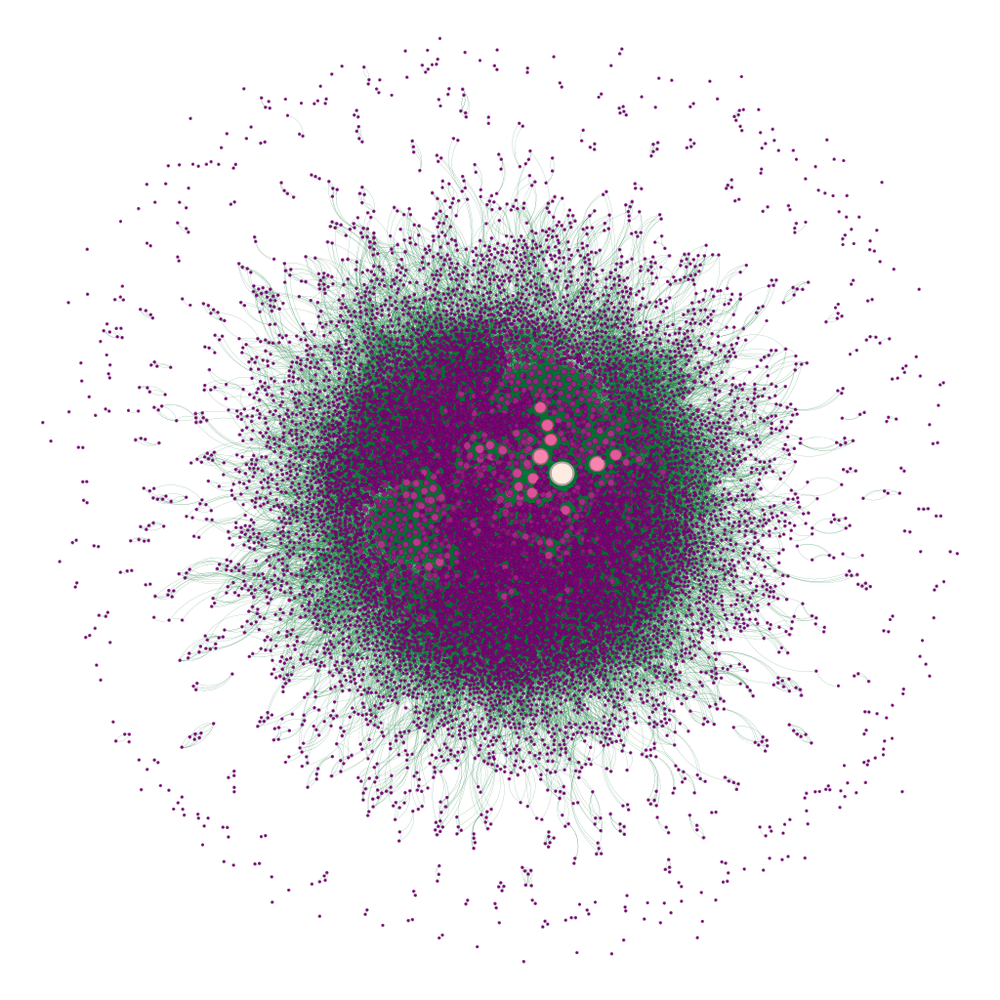
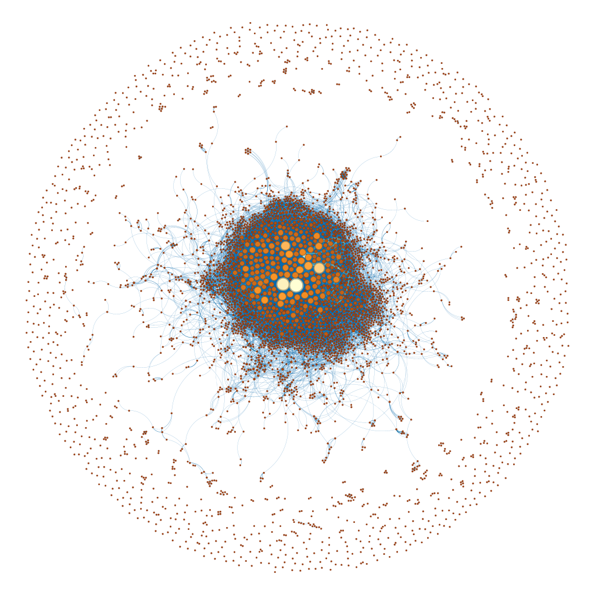

# Changes in the representation of women in jazz: A festival network study

In this master thesis, we will analyze the networks built from the Montreux Jazz Festival data. Two networks are built: The concert network and the musicians network. In the first, each node corresponds to a concert, and two concerts are linked if they have a musician in common. In the second, each musician corresponds to a node, and two musicians are linked if they have performed together. For both networks, we will analyze their parameters and topologies. In addition, we will examine different centralities in order to determine the most important musicians in these networks. Furthermore, we will construct and analyze meta-networks related to the music genres present at the festival. Next, we will investigate the size of the giant component of the two networks to determine which instruments had the greatest impact at the festival. Finally, we will study the changes in the representation of women at the festival, which is the main question this master thesis seeks to answer.

## Social network visualization

## Concert network visualization

## Directories organisation

`/code` : Contains all the code to obtain the results of the master thesis 

`/data`: Contains all the data on albums, instruments, music genres, and so on. it contains also all the plots made for the master thesis. Note that the data from Montreux Jazz Festival are not here as there are protected by a NDA.

`/latex_report`: Contains the latex code for the master thesis report as well as all images used in it and the report in pdf of the master thesis. 

`+networks` : Contains all the gephi networks file and images of the networks used in the master thesis

### Old 

`/pre-master-thesis`: Contains pre-master thesis works from 2023 

`/presentation` : Presentation of the pre-master thesis from 2023